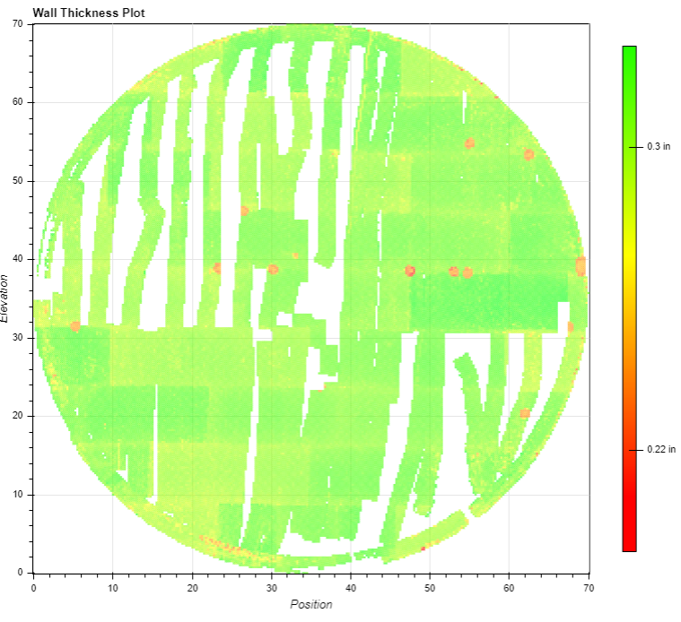

# Python React Practical: Full Stack

Hi there! 😀

# Access point list

- route to: '/Calender' for calender component.
- route to: 'Data' for chart.

## Getting Started

To get started, you'll need [Docker](https://docs.docker.com/get-docker/). This exercise packages a React frontend and a Django backend using [Docker Compose](https://docs.docker.com/compose/). To complete it, you will need to make modifications to both. Hot reloading is configured and we've tried to make it as easy as possible to get started (including some seed data).

If you have Docker, all you should need to do is run

```console
docker-compose up
```

- Your React app is here: http://localhost:3000/
- Your Django backend is here: http://localhost:8000/

If you want to access Django Admin, you can find it at: http://localhost:8000/admin/ Your login is "root" / "practical".

Before you start developing, you will also want to install [pre-commit](https://pre-commit.com/) and then install the hooks:

```console
pre-commit install
```

For now, this just ensures that Python code is formatted with [Black](https://black.readthedocs.io/en/stable/).

As you work on the project, feel free to add other open source dependencies.

## OK, I'm set up — now what?

Great! Please create a new branch in your repo and proceed with the relevant directions depending on the role you're interviewing for:

### Frontend

- Connect the calendar to the endpoint (/inspections/?format=json). Currently the calendar renders a placeholder event.
- Split the app into two pages: Calendar and Data.
- Build out the Data page: There is a data.json file which contains the data for a C-Scan heatmap. Below is an example of what this might look like. You do not need to make it look the same! You will need to have a plot with axis labels and a colorscheme (again not necessarily the same one -- whatever makes sense to you). Hovering over a bin of data should have a tooltip that shows the thickness.



### Full Stack

First, you'll need to do the same things as the Frontend (above).

In addition, you will need to add functionality to the scheduler: In addition to rendering Inspections on the calendar, we want to show Plant Maintenance tasks. Every task should be scheduled to occur on a particular date, and should have a title and description. You will need to modify both the frontend and the backend to accomplish this. The description is not required to be shown on the frontend for this exercise, though it should at least be stored and exposed via the API.

## Submitting

NOTE: Before submitting, make sure that everything works from scratch: `docker-compose build` and `docker-compose up`! Your reviewer(s) need to be able to run your code with Docker Compose, just like the sample app was supplied that way.

To submit your code, please create a new repo on GitHub and open a pull request from your feature branch back to master.

In your pull request, please consider what context you would want to share with your reviewers (e.g., any reasoning behind major design decisions).

## Questions

If you have any questions at all, please email us!
